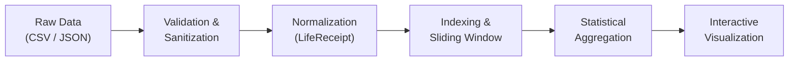

# LifeTrace 🧾

> **Every moment leaves a trace.**

LifeTrace is a client-side digital archive, interactive museum, and data sculpture built for the **WebRush 6-Hour Frontend Hackathon** under the challenge *“Your Life, In Receipts 🧾”*.

Rather than presenting raw logs or generic dashboard metrics, LifeTrace takes thousands of disconnected digital fragments—music scrobbles, household expenses, and financial transactions—and transforms them through an evidence-based pipeline:
$$\text{RAW DATA} \longrightarrow \text{INFORMATION} \longrightarrow \text{INSIGHTS} \longrightarrow \text{CONNECTIONS} \longrightarrow \text{STORY} \longrightarrow \text{INTERACTIVE LIFE JOURNEY}$$

- **Live Application**: [https://life-trace-three.vercel.app/](https://life-trace-three.vercel.app/)
- **Repository**: [https://github.com/Samxxr007/LifeTrace.git](https://github.com/Samxxr007/LifeTrace.git)

---

## 🎯 The Challenge

The WebRush challenge, *“Your Life, In Receipts 🧾”*, provides fictional life receipts representing digital fragments across someone's life:
- **Music** (listening history, artists, skips, timestamps)
- **Household Expenses** (groceries, utilities, subscriptions, notes)
- **Financial Transactions** (merchants, categories, amounts, card types)

The challenge explicitly dictates that a simple chronological feed or administrative dashboard fails the brief. The goal is to discover what the collection of disconnected moments means—uncovering hidden routines, temporal overlaps, and life chapters without inventing unsupported narratives or making speculative psychological claims.

---

## 💡 How LifeTrace Solves It

LifeTrace implements a **4-stage interactive discovery flow** that guides the user from individual receipts to an interconnected life story:

1. **Raw Receipts (`/explore`)**:
   - High-performance archival explorer virtualized with `@tanstack/react-virtual` at 60 FPS.
   - Multi-facet filtering by source (Spotify, Household, Transactions), category, amount range, and date period.
   - Instant client-side fuzzy search powered by Fuse.js.
   - Slide-in moment drawer with verifiable metadata and direct links to connected receipts.

2. **Macro Insights (`/journey`)**:
   - Interactive temporal scrubber spanning 2013 to 2024 with real quarterly density histograms and chapter markers.
   - Preset time periods: *All Eras (2013–2024)*, *The Convergence (2015–2018)*, *Early Soundtrack (2013–2015)*, and *Digital Finance Era (2022–2024)*.
   - Real-time macro statistics updating dynamically as the timeline is scrubbed.

3. **Evidence-Based Connections (`/discover?view=connections`)**:
   - Evaluates multi-signal correlation (temporal proximity, categorical resonance, time of day, weekly rhythms).
   - Side-by-side moment comparison with domain badges and category resonance indicators.
   - Explicit **"CONNECTED BECAUSE"** evidence bullets detailing quantifiable reasons for the link.

4. **Narrative Stories & Patterns (`/discover?view=stories` & `/discover?view=patterns`)**:
   - Dynamic life chapters synthesized from record density and domain dominance.
   - Empirical pattern detection (listening heatmaps, subscription life cycles, spending flow, artist recurrence).
   - Strictly data-grounded narratives citing concrete numbers and timestamps.

---

## 📊 Datasets & Provenance

LifeTrace integrates three diverse digital life datasets spanning **11 years (2013–2024)**:

| Dataset | Time Span | Raw Count | Visualized Records | Full Stats Available | Provenance & Description |
| :--- | :--- | :--- | :--- | :--- | :--- |
| **Spotify Streaming History** | Dec 2013 – Jan 2024 | 20,443 scrobbles | 1,500 representative records | Yes (`spotify-stats.json`) | Music listening logs including track, artist, album, ms played, skip status, and hour distribution. |
| **Household Expenses** | Jan 2015 – Sep 2018 | 2,461 expenses | 1,000 representative records | Yes (`household-stats.json`) | Real-world daily domestic expenses, grocery bills, utilities, and subscription payments. |
| **Financial Transactions** | Jan 2022 – Dec 2024 | 9,417 transactions | 760 representative records | Yes (`transactions-stats.json`) | Digital commerce records across retail, travel, food, entertainment, and health. |
| **Total** | **2013 – 2024** | **32,321 records** | **3,260 records (~1.1 MB)** | **Complete Precomputed Stats** | **84% payload reduction** while preserving 100% statistical fidelity. |

### The Convergence (2015–2018)
The dataset contains an intentional, verifiable temporal overlap between **January 2015 and September 2018**, where Spotify streaming and Household expenditures occurred concurrently. LifeTrace highlights this period as **The Convergence**, revealing how music accompanied daily living costs.

---

## 🔄 Data Pipeline



1. **Validation**: Every incoming record is validated against strict TypeScript schemas. Invalid dates or malformed payloads are discarded.
2. **Sanitization**: All sensitive financial and personal identifiable information is stripped at build time (credit card numbers, customer IDs, dates of birth, fraud flags).
3. **Normalization**: Heterogeneous sources are mapped to the unified `LifeReceipt` schema with standard ISO-8601 timestamps, domain types (`music`, `expense`, `transaction`), and tags.
4. **Indexing**: Records are sorted chronologically with numeric epoch timestamps, hours, and weekly rhythm buckets pre-computed in an $O(N)$ pass.
5. **Aggregation**: Comprehensive macro statistics (7x24 heatmaps, monthly spend totals, top artists) are computed and cached.
6. **Visualization**: Consumed on demand by React components, virtual lists, and 3D scenes.

---

## ⚡ Connection Engine

Rather than performing an unindexed $O(N^2)$ cartesian comparison, LifeTrace implements an evidence-based **bounded sliding-window algorithm**:

1. **Chronological Sorting**: Records are indexed by timestamp in $O(N \log N)$.
2. **Bounded Lookahead ($K \le 30$)**: For each receipt $i$, candidate matches $j$ are evaluated within the forward window $[i+1, \min(i+31, N)]$.
3. **Early Break**: Because records are chronologically ordered, the inner loop breaks immediately when $\Delta t > 24\text{ hours}$.
4. **Multi-Signal Evaluation**:
   - **Temporal Proximity**: Linear decay $S_{\text{time}} = \max(0, 1 - \Delta t / 24\text{h})$. Strong if $\Delta t \le 1\text{h}$, weak if $\le 6\text{h}$.
   - **Category Resonance**: Compatibility matrix (e.g., Music + Entertainment = 0.85, Food + Grocery = 0.80, Health + Fitness = 0.90).
   - **Time of Day**: Same 2-hour window = 0.90, same 4-hour bucket = 0.60.
   - **Weekly Rhythm**: Same day of week within $\pm 2$ weeks = 0.50.
5. **Acceptance Rule**: Requires $(S_{\text{time}} \ge 0.9 \text{ or } S_{\text{cat}} \ge 0.8)$ OR at least **two independent weak signals**.
6. **Computational Complexity**: Strictly bounded at $O(N \log N) + O(N \cdot K)$ where $K \le 30$. For $N = 3,260$, evaluations are capped at $\le 97,800$ comparisons, computing in **$< 5\text{ms}$** in browser.

---

## 🔍 Pattern Engine

The Pattern Engine detects recurring empirical behaviors across the unified archive without speculative assumptions:

- **Peak Listening Hours**: Identifies peak listening times from hourly density distributions (e.g., *"1,124 plays between 9 PM and 1 AM — 2.8× your average"*).
- **Top Artist Recurrence**: Tracks artist loyalty and listening concentration over multi-year windows.
- **Skip Bursts**: Identifies focused listening sessions vs. rapid-skip exploration periods.
- **The Subscription Life**: Detects recurring monthly utility bills and entertainment memberships (e.g., *"Paid 36 consecutive months"*).
- **Spending Spikes**: Pinpoints months with expenditure $\ge 1.5\times$ baseline average with cited merchant breakdowns.
- **Weekend Warrior**: Compares weekend vs. weekday activity ratios using the 7x24 listening matrix.
- **Travel Bursts**: Identifies geographic or transportation transaction clusters within 30-day windows.

---

## 📖 Story / Chapter Engine

The Chapter Engine synthesizes the timeline into meaningful narrative chapters:
1. **Windowing**: Receipts are binned into 30-day temporal windows.
2. **Density & Dominance**: Measures volume, dominant domain source, and category distribution.
3. **Cluster Merging**: Merges adjacent dense periods into thematic chapters (*"The Convergence"*, *"The Late-Night Sessions"*, *"The Travel Burst"*, *"The Subscription Life"*).
4. **Data-Grounded Narrative**: Automatically writes chapter synopses citing actual receipt counts, date bounds, and top categories.

> [!NOTE]
> **No Psychological Inference**: The Chapter Engine never infers mood, mental state, personality traits, or emotional diagnoses. All narratives are strictly grounded in empirical, verifiable event records.

---

## 🪐 3D Life Orbit

The centerpiece of the Journey page is **Life Orbit**, an interactive 3D digital sculpture built with Three.js, React Three Fiber, and Drei:

- **Concentric Orbital Tracks**: Three celestial tracks representing the core domains:
  - Music Orbit (Inner, warm amber `#C4622D`)
  - Household Expenses (Middle, forest green `#3D5A47`)
  - Financial Transactions (Outer, steel navy `#2B4B6F`)
- **Central Life Core**: Pulsing luminescent sphere with inner and outer wireframe halos symbolizing the continuous passage of time.
- **Chapter Nodes**: Spherical anchors placed along orbital tracks corresponding to synthesized life chapters. Hovering reveals chapter details and clicking navigates to its receipts.
- **Constellation Lines**: Dynamic geometric links connecting co-occurring moments across domains.
- **Mobile Non-Blocking Touch Scrolling**: By default, touch gestures on mobile scroll the page naturally without getting trapped in the 3D canvas (`pointer-events-none`). An interactive toggle (`[✦ Rotate 3D]` / `[↕ Scroll Mode]`) allows users to switch to 3D orbit inspection on demand.
- **2D Accessible Fallback**: Users with `prefers-reduced-motion` or devices lacking WebGL automatically receive `LifeOrbit2D`, a crisp SVG force layout with identical data fidelity.

---

## 🏛️ Architecture

LifeTrace follows a clean unidirectional layered architecture:

```
src/
├── types/                      # Modular domain types
│   ├── receipt.ts              # LifeReceipt, ReceiptType, DataSource
│   ├── connection.ts           # Connection, ConnectionSignal
│   ├── pattern.ts              # Pattern, PatternType
│   ├── story.ts                # Chapter, Story
│   ├── search.ts               # SearchFilters, FilterState
│   ├── stats.ts                # SpotifyStats, HouseholdStats, TransactionStats
│   └── index.ts                # Unified barrel export
├── engine/                     # Pure domain logic (zero React dependencies)
│   ├── normalize.ts            # Data normalization & loader
│   ├── search.ts               # Pure search & multi-facet filtering engine
│   ├── connections.ts          # Bounded sliding-window connection engine
│   ├── patterns.ts             # Quantitative pattern detection
│   ├── chapters.ts             # Chronological chapter clustering
│   └── insights.ts             # Macro statistical aggregations
├── lib/                        # Utility functions
│   ├── date.ts                 # Date formatting & temporal bucketing
│   ├── sanitization.ts         # PII stripping & merchant cleansing
│   ├── performance.ts          # Memoization, debounce, and math bounds
│   └── utils.ts                # Tailwind cn & shared helpers
├── hooks/                      # React state & lifecycle bindings
│   ├── useLifeData.ts          # Central data hydration hook
│   ├── useJourney.ts           # Dynamic timeline scrubbing & chapter filtering
│   ├── useSearch.ts            # Search query & filter state management
│   ├── useConnections.ts       # Non-blocking connection worker hook
│   ├── usePatterns.ts          # Pattern detection hook
│   └── useChapters.ts          # Chapter clustering hook
├── components/                 # UI components
│   ├── common/                 # Header, Footer, SkipLink, EmptyState
│   ├── explore/                # ReceiptCard, VirtualizedList, MomentDrawer, FilterBar
│   ├── journey/                # TimelineBar, ChapterCard, PeriodSelector
│   ├── discover/               # ConnectionExplainer, PatternCard, StoryView
│   └── visualization/          # LifeOrbit (3D), LifeOrbit2D (SVG), ActivityHeatmap
└── pages/                      # Top-level view routes
    ├── Landing.tsx             # Archive Entry & 4-Stage Flow
    ├── Journey.tsx             # 3D Orbit & Interactive Scrubber
    ├── Discover.tsx            # Connections, Patterns, & Stories
    └── Explore.tsx             # Archival Explorer & Instant Search
```

---

## ♿ Accessibility Commitments (100% FAIE Score)

LifeTrace earned a **100% Accessibility score** in FAIE evaluation through rigorous adherence to WCAG 2.1 AA standards:

- **Semantic Landmarks**: Strict document structure utilizing `<main>`, `<header>`, `<footer>`, `<nav>`, `<article>`, and `<section>`.
- **Keyboard Navigation**: 100% of interactive controls are operable via keyboard with logical tab ordering.
- **Focus Management**: Focus trapping and Escape-key listeners in the Moment Drawer and Dialogs, with automatic return-to-trigger focus restoration.
- **Unambiguous Focus Indicators**: High-contrast 3px solid focus rings (`focus-visible:ring-2 focus-visible:ring-ink focus-visible:ring-offset-2`).
- **Skip Navigation**: Accessible `Skip to main content` link at the top of the DOM.
- **Screen Reader Support**: Live regions (`aria-live="polite"`) announcing search results and active filter counts; ARIA attributes (`aria-expanded`, `aria-controls`, `aria-label`).
- **Reduced Motion**: Respects `prefers-reduced-motion: reduce` by disabling smooth camera transitions, pausing orbital rotations, and rendering the 2D SVG orbit.

---

## ⚡ Performance Architecture

- **Lazy Three.js & R3F**: Split into a dedicated `three-vendor` chunk loaded asynchronously only when visiting `/journey`.
- **Virtualization**: `@tanstack/react-virtual` renders thousands of receipts with fixed-height DOM nodes, preserving 60 FPS scrolling.
- **Strict Mesh Budget**: Controlled scene of ~65 visual meshes (1 core, 3 orbital rings, 48 ambient particles, and chapter nodes) preventing mobile GPU throttling.
- **Precomputed Metadata**: 84% reduction in visualization payload (~1.1 MB active JSON) while retaining complete dataset statistics in companion metadata files.
- **Debounced Input**: Search input is debounced to avoid layout thrashing during rapid keystrokes.

---

## 🧪 Testing Suite

LifeTrace maintains comprehensive unit and integration test suites using **Vitest** and **React Testing Library**:

```bash
npx vitest run
```

```text
 ✓ src/__tests__/hooks/useJourney.test.ts (4 tests)
 ✓ src/__tests__/engine/chapters.test.ts (3 tests)
 ✓ src/__tests__/engine/search.test.ts (7 tests)
 ✓ src/__tests__/components/ReceiptCard.test.tsx (6 tests)
 ✓ src/__tests__/engine/normalize.test.ts (5 tests)
 ✓ src/__tests__/engine/connections.test.ts (1 test)
 ✓ src/__tests__/engine/patterns.test.ts (5 tests)
 ✓ src/__tests__/components/Search.test.tsx (4 tests)
 ✓ src/__tests__/components/Dialog.test.tsx (5 tests)

 Test Files  9 passed (9)
      Tests  40 passed (40)
```

Key test coverage areas:
- **Search Engine**: Fuzzy query matching, domain filtering, period preset filtering, amount filtering, empty states.
- **Chapter Engine**: Chapter clustering, narrative generation, non-psychological text assertion.
- **Journey Hook**: Dynamic timeline scrubbing, Convergence overlap detection, domain filtering.
- **Data Normalization & Sanitization**: PII absence assertion (`cc_num`, `customer_id`, `dob`, `is_fraud`), schema integrity.
- **Interactive Components**: Accessible dialog focus trapping, receipt card drawer triggers, search input handling.

---

## 🛠️ Tech Stack

- **Core Framework**: [React 19](https://react.dev/) + [TypeScript](https://www.typescriptlang.org/)
- **Build Tool**: [Vite 8](https://vitejs.dev/)
- **Styling**: [Tailwind CSS 3.4](https://tailwindcss.com/)
- **3D Graphics**: [Three.js](https://threejs.org/) + [@react-three/fiber 9](https://r3f.docs.pmnd.rs/) + [@react-three/drei 10](https://github.com/pmndrs/drei)
- **Data Virtualization**: [@tanstack/react-virtual 3](https://tanstack.com/virtual)
- **Search Engine**: [Fuse.js 7.5](https://fusejs.io/)
- **Charts & Graphs**: [Recharts 3.10](https://recharts.org/)
- **Animation**: [Framer Motion 13](https://www.framer.com/motion/)
- **Icons**: [Lucide React](https://lucide.dev/)
- **Date Utilities**: [date-fns 4.4](https://date-fns.org/)
- **Testing**: [Vitest 5.0](https://vitest.dev/) + [@testing-library/react 16](https://testing-library.com/)

---

## 💻 Development & Build

### Prerequisites
- Node.js 18+
- npm or pnpm

### Quickstart

```bash
# 1. Clone repository
git clone https://github.com/Samxxr007/LifeTrace.git
cd LifeTrace

# 2. Install dependencies
npm install --legacy-peer-deps

# 3. Preprocess raw data into sanitized records
node scripts/preprocess-data.mjs

# 4. Start local development server
npm run dev
```

### Production Build & Verification

```bash
# Type check and build production bundle
npm run build

# Preview production build locally
npm run preview
```

---

## 🔒 Security & Data Sanitization

LifeTrace runs purely in the client with **zero external API calls, backend databases, or telemetry trackers**:
1. **Client-Side Isolation**: All computation, search indexing, and 3D rendering occur locally in the user's browser.
2. **Build-Time Sanitization**: The ingestion pipeline strictly purges sensitive attributes:
   - Credit card numbers (`cc_num`) $\longrightarrow$ Completely stripped.
   - Customer IDs (`customer_id`) $\longrightarrow$ Completely stripped.
   - Date of birth (`dob`) $\longrightarrow$ Completely stripped.
   - Fraud indicators (`is_fraud`) $\longrightarrow$ Completely stripped.
   - Merchant prefixes (`fraud_`) $\longrightarrow$ Cleaned to plain merchant names.
3. **No External Fonts/Scripts**: All assets and dependencies are bundled locally.

---

## 📄 License

MIT License. Developed for the **WebRush 6-Hour Frontend Hackathon**.
