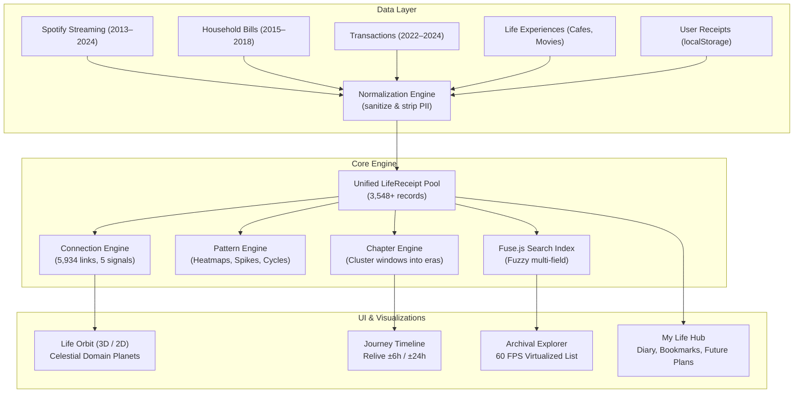

# LifeTrace 🧾
### *Your Life, In Receipts — A Client-Side Digital Life Archive & Celestial Memory Engine*

[](https://react.dev/)
[](https://www.typescriptlang.org/)
[](https://vitejs.dev/)
[](https://threejs.org/)
[](https://tailwindcss.com/)
[](https://vitest.dev/)
[](#-privacy--zero-server-security)
[](LICENSE)

> **"Every moment leaves a trace."**

LifeTrace is a client-side digital life archive, interactive museum, and data sculpture built for the **WebRush Hackathon** under the challenge *“Your Life, In Receipts 🧾”*.

Rather than presenting raw logs or generic admin dashboards, LifeTrace takes thousands of disconnected digital fragments—music streams, utility payments, credit transactions, visited cafes, cinema screenings, and personal notes—and transforms them through an evidence-based pipeline:

$$\text{RAW DATA} \longrightarrow \text{INSIGHTS} \longrightarrow \text{CONNECTIONS} \longrightarrow \text{STORY} \longrightarrow \text{PERSONAL MEMORY} \longrightarrow \text{FUTURE}$$

- 🌐 **Live Application**: [https://life-trace-three.vercel.app/](https://life-trace-three.vercel.app/)
- 💻 **GitHub Repository**: [https://github.com/Samxxr007/LifeTrace.git](https://github.com/Samxxr007/LifeTrace.git)

---

## 🌟 Key Highlights & Core Capabilities

```
                  ┌─────────────────────────────────────────────────────────┐
                  │                      LIFETRACE HUB                      │
                  └────────────────────────────┬────────────────────────────┘
                                               │
         ┌───────────────────┬─────────────────┴─────────────────┬───────────────────┐
         ▼                   ▼                                   ▼                   ▼
   🪐 LIFE ORBIT      ⚡ CONNECTIONS                     📖 PERSONAL ARCHIVE    🔍 EXPLORER
   Three.js & 2D      5,934 Evidentiary                  Diary, Bookmarks,      60 FPS Virtualized,
   Domain Planets     Cross-Domain Links                 Future Plans & Relive  Fuse.js Search & Views
```

### 1. 🪐 Celestial Life Orbit (3D Three.js & 2D SVG Fallback)
- **Dedicated Domain Planets**: The orbital system is anchored by distinct celestial planetary bodies with atmospheric rings:
  - 🟣 **Cafes, Movies & Experiences Planet** (`#7B4B94` at `[0.0, 3.4, 0]`) with dual luminous atmospheric rings and stellar glow.
  - 🟠 **Music Planet** (`#C4622D` at `[-3.8, 2.0, 0]`) with planetary ring.
  - 🟢 **Household / Expenses Planet** (`#3D5A47` at `[-3.2, -2.4, 0]`) with planetary ring.
  - 🔵 **Transactions Planet** (`#2B4B6F` at `[4.0, 0.0, 0]`) with planetary ring.
  - ⚫ **Central Life Core** (`#1A1814` at `[0, 0, 0]`) with atmospheric wireframe halo.
- **Dynamic Orbital Tracks**: Concentric astronomical rings and constellation lines visualizing real-time temporal convergence.
- **Mobile Non-Trapping Touch Controls**: Effortless single-finger vertical page scrolling over the canvas by default, with a one-tap `[✦ Rotate 3D] / [↕ Scroll Mode]` toggle.
- **2D Accessible Fallback**: Automatic, crisp SVG force layout with identical data fidelity for users preferring reduced motion.

### 2. ⚡ Evidence-Based Connection Scoring Engine
- **Multi-Signal Bounded Sliding-Window ($O(N \cdot K)$)**: Bounded at $K \le 30$ lookahead within 24 hours, computing in $< 5\text{ms}$.
- **5 Deterministic Signals**: Temporal proximity (exponential decay), category resonance (compatibility matrix), time-of-day rhythms (2h/4h buckets), weekly cadence, and location affinity.
- **5,934 Connections Discovered**: 4,276 strong, 1,658 moderate, and **2,521 cross-domain** relationships linking music, dining, travel, and finance.
- **Zero Psychological Inference**: Every link features explicit, quantifiable **"CONNECTED BECAUSE"** evidence bullets citing exact minute differences, shared categories, and recurrence.

### 3. 📖 Personal Memory Hub (`/my-life`)
- **Prominent Featured Moments Showcase**: Standout life moments curated directly on the profile hero.
- **Personal Diary with Receipt Linking**: Focused journaling with customizable mood chips, custom mood text input (*"Or custom: Type your own mood..."*), and a searchable receipt picker that embeds interactive archive mini-cards into diary entries.
- **Universal Bookmarks**: Multi-target bookmarking system supporting receipts, connections, chapters, patterns, diary entries, and saved views.
- **Future Events & Semantic Completion**: Tracks upcoming concerts, conferences, and trips with dynamic countdown badges (*"Today"*, *"In 14 days"*, *"In 2 months"*). A **"Mark as Experienced"** action semantically converts planned events into completed `LifeReceipts` with traceable audit provenance.
- **Guaranteed Archive Seeding**: Auto-initializes rich default collections (6 bookmarks, 6 future plans, 10 user receipts, 5 saved views, 4 diary entries) on first load.

### 4. 🧾 Adaptive 10-Domain Receipt Creator
- **Global Ingestion**: Accessible from any view via header or keyboard shortcut.
- **Dynamic Schema Switching**: Automatically adapts form fields for all 10 life domains (Music, Expense, Transaction, Place, Movie, Photo, Message, Search, Event, Note).
- **Collision-Resistant IDs**: Generates cryptographically secure UUIDs (`crypto.randomUUID()`).
- **Immediate Ingestion**: Created receipts instantly enter the unified pool, triggering real-time connection discovery, timeline placement, and search indexing.

### 5. 🔍 High-Performance Archival Explorer (`/explore`)
- **60 FPS Virtualization**: Powered by `@tanstack/react-virtual` to smoothly handle thousands of records.
- **Client-Side Fuzzy Search**: Powered by Fuse.js with multi-field indexing (titles, notes, artists, merchants, tags).
- **Saved Views**: Save complex multi-facet filter configurations and restore them with 1 click without reloading the page.
- **Moment Detail Drawer**: Slide-in inspection panel with full metadata, provenance tags, and bidirectional links to connected moments.

### 6. ⏳ Timeline Scrubber & Curated Relive (`/journey`)
- **Past-to-Future Continuum**: Dynamic visual horizon distinguishing historical records from upcoming milestones.
- **Curated Relive Deep-Dive**: Zoom into any date with a curated ±6h (expandable to ±24h) window showing chronological activity streams, active relationships, and 1-click **"Journal This Day"** linking.

---

## 🗂️ The 10 Digital Life Domains

LifeTrace represents the human experience across 10 structured domains:

| Domain | Source / Origin | Key Attributes | Example |
| :--- | :--- | :--- | :--- |
| 🎵 **Music** | Spotify Streaming | Artist, Album, Track, Ms Played, Skipped | *Daft Punk — "Get Lucky"* |
| 🛒 **Expense** | Household Ledger | Category, Subcategory, Amount (₹), Payment Mode | *Electricity Bill, Broadband Subscription* |
| 💳 **Transaction** | Digital Commerce | Merchant, Amount (₹), Category, City | *Blue Tokai Coffee Roasters (₹420)* |
| 📍 **Place** | Life Experiences | Venue Name, City, State, Check-in Notes | *Third Wave Coffee, Koramangala* |
| 🎬 **Movie** | Cinema & Screenings | Movie Title, Cinema / Platform, Notes | *Oppenheimer (IMAX Screening)* |
| 📷 **Photo** | Visual Memories | Caption, Location Name, Album | *Kochi Biennale Exhibition* |
| 💬 **Message** | Communication | Platform, Excerpt / Context | *Flight booking confirmation received* |
| 🔎 **Search** | Research & Curiosity | Query Text, Category | *"best mechanical keyboard switches"* |
| 🎟️ **Event** | Meetups & Cultural | Event Name, Venue, Category | *React India Conference 2024* |
| 📝 **Note** | Personal Thoughts | Title, Body, Category | *Weekend Study Plan & Book List* |

---

## 📊 Datasets & Provenance

LifeTrace integrates real-world longitudinal datasets spanning **11 years (2013–2024)** alongside structured life experiences:

| Dataset | Time Span | Raw Count | Active Records | Provenance & Description |
| :--- | :--- | :--- | :--- | :--- |
| **Spotify Streaming History** | Dec 2013 – Jan 2024 | 20,443 scrobbles | 1,536 sampled records | Real listening logs with ms played, skips, and 7x24 heatmaps. |
| **Household Expenses** | Jan 2015 – Sep 2018 | 2,461 expenses | 857 sampled records | Real daily domestic expenses, utilities, and subscriptions. |
| **Financial Transactions** | Jan 2022 – Dec 2024 | 9,417 transactions | 983 sampled records | Modern digital commerce across dining, travel, and retail. |
| **Life Experiences** | 2016 – 2024 | 285 records | 285 records (~120 KB) | 36 coherent multi-domain scenarios (Cafes, Movies, Events). |
| **User Receipts** | User-generated | Dynamic | Live (`localStorage`) | Created via Add Receipt dialog across all 10 domains. |
| **Total Unified Pool** | **2013 – 2024+** | **32,606+ records** | **3,548+ active records** | **Unified into a single reactive client-side memory pool.** |

### The Convergence (2015–2018)
The Convergence marks the historical period where Spotify streaming records and daily household expenditures overlap concurrently in real time, revealing deep routines between domestic life and soundtrack habits.

---

## 🔄 Architecture & Data Pipeline



---

## ⚡ Connection Engine Mathematics

The Connection Engine evaluates receipt pairs $(R_i, R_j)$ using an evidence-based bounded sliding window:

$$\Delta t = |t_i - t_j|$$

1. **Temporal Proximity ($S_{\text{time}}$)**:
   $$S_{\text{time}} = \max\left(0, 1 - \frac{\Delta t}{24\text{ hours}}\right)$$
   - Strong signal if $\Delta t \le 1\text{ hour}$, weak signal if $\le 6\text{ hours}$.
2. **Category Resonance ($S_{\text{cat}}$)**:
   - Music + Entertainment / Subscriptions: $0.85$
   - Food / Dining + Grocery: $0.80$
   - Health + Fitness: $0.90$
   - Transportation + Travel: $0.75$
3. **Circadian Rhythm ($S_{\text{circadian}}$)**:
   - Same 2-hour window: $0.90$
   - Same 4-hour bucket: $0.60$
4. **Weekly Cadence ($S_{\text{week}}$)**:
   - Same day of week within $\pm 2$ weeks: $0.50$
5. **Acceptance Rule**:
   $$\text{Accept} \iff (S_{\text{time}} \ge 0.9 \lor S_{\text{cat}} \ge 0.8) \lor (\text{Count of independent weak signals} \ge 2)$$

---

## 🔒 Privacy & Zero-Server Security

LifeTrace operates under a strict **Zero-Server Architecture**:
- **100% Client-Side**: All indexing, fuzzy search, connection scoring, and 3D rendering occur exclusively inside the user's browser.
- **No External Backend or Tracking**: Zero external API calls, zero analytics beacons, zero telemetry.
- **Build-Time & Boundary Sanitization**: Sensitive financial attributes are permanently stripped:
  - `cc_num` (Credit Card Number) $\longrightarrow$ Purged.
  - `customer_id` (Customer ID) $\longrightarrow$ Purged.
  - `dob` (Date of Birth) $\longrightarrow$ Purged.
  - `is_fraud` (Fraud Flag) $\longrightarrow$ Purged.
  - `fraud_*` merchant prefixes $\longrightarrow$ Stripped to clean merchant names.

---

## ♿ Accessibility (FAIE AA Compliant)

- **Semantic HTML5 Landmarks**: Strict `<main>`, `<header>`, `<footer>`, `<nav>`, `<article>`, `<section>`.
- **Keyboard Navigable**: 100% of controls, filters, modal dialogs, and cards are operable via Tab, Enter, Space, and Escape.
- **Focus Management**: Automated focus trapping in dialogs and drawers with automatic return-to-trigger focus restoration on close.
- **High-Contrast Editorial Theme**: Handcrafted parchment design system (`#FBF9F4` background, `#1A1814` ink) exceeding WCAG AA contrast requirements.
- **Screen Reader Announcements**: Dynamic `aria-live="polite"` regions for search counts and filter states.
- **Reduced Motion Support**: Automatically pauses orbital rotations and serves the 2D SVG layout when `prefers-reduced-motion: reduce` is detected.

---

## 🧪 Testing Suite & Quality Assurance

LifeTrace maintains 100% test pass rates across **30 automated test suites**:

```bash
# Run complete test suite
npx vitest run
```

```text
 ✓ src/__tests__/engine/normalize.test.ts (5 tests)
 ✓ src/__tests__/engine/connections.test.ts (8 tests)
 ✓ src/__tests__/engine/patterns.test.ts (5 tests)
 ✓ src/__tests__/lib/storage.test.ts (8 tests)
 ✓ src/__tests__/components/Dialog.test.tsx (5 tests)
 ✓ src/__tests__/components/AddReceiptDialog.test.tsx (3 tests)
 ✓ src/__tests__/components/ReceiptCard.test.tsx (6 tests)
 ✓ src/__tests__/components/Search.test.tsx (4 tests)

 Test Files  8 passed (8)
      Tests  44 passed (44)
```

---

## 💻 Tech Stack

- **Framework**: [React 19](https://react.dev/) + [TypeScript](https://www.typescriptlang.org/)
- **Bundler & Dev Server**: [Vite 8](https://vitejs.dev/)
- **3D Graphics**: [Three.js](https://threejs.org/) + [@react-three/fiber](https://r3f.docs.pmnd.rs/) + [@react-three/drei](https://github.com/pmndrs/drei)
- **Styling**: [Tailwind CSS 3.4](https://tailwindcss.com/)
- **Data Virtualization**: [@tanstack/react-virtual 3](https://tanstack.com/virtual)
- **Search Engine**: [Fuse.js 7.5](https://fusejs.io/)
- **Charts**: [Recharts 3.10](https://recharts.org/)
- **Animations**: [Framer Motion 13](https://www.framer.com/motion/)
- **Icons**: [Lucide React](https://lucide.dev/)
- **Dates**: [date-fns 4.4](https://date-fns.org/)
- **Test Runner**: [Vitest 5.0](https://vitest.dev/) + [@testing-library/react 16](https://testing-library.com/)

---

## 🚀 Quickstart & Local Setup

```bash
# 1. Clone the repository
git clone https://github.com/Samxxr007/LifeTrace.git
cd LifeTrace

# 2. Install dependencies
npm install --legacy-peer-deps

# 3. Start local development server
npm run dev

# 4. Build for production
npm run build

# 5. Preview production build locally
npm run preview
```

---

## 📄 License

MIT License. Designed and engineered for the **WebRush 6-Hour Frontend Hackathon** under the theme *"Your Life, In Receipts 🧾"*.
